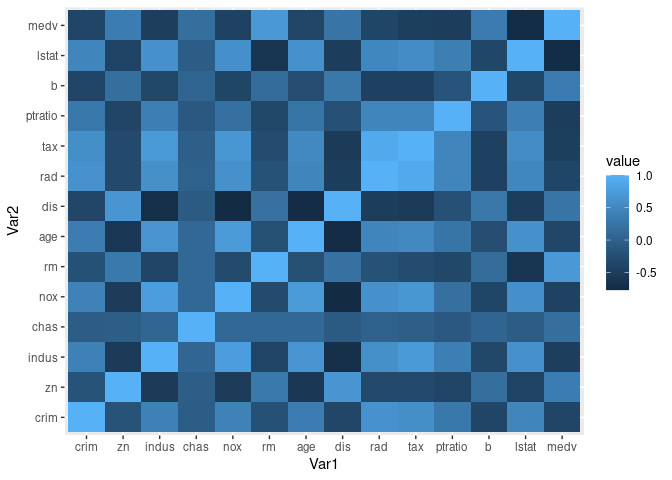

## Dataset

Dataset used is Boston Housing Dataset.

### Abbreviations used
    1. CRIM - per capita crime rate by town
    2. ZN - the proportion of residential land zoned for lots over 25,000 sq.ft.
    3. INDUS - the proportion of non-retail business acres per town.
    4. CHAS - Charles River dummy variable (1 if tract bounds river; 0 otherwise)
    5. NOX - nitric oxides concentration (parts per 10 million)
    6. RM - the average number of rooms per dwelling
    7. AGE - the proportion of owner-occupied units built prior to 1940
    8. DIS - weighted distances to five Boston employment centers
    9. RAD - index of accessibility to radial highways
    10. TAX - full-value property-tax rate per $10,000
    11. PTRATIO - pupil-teacher ratio by town
    12. B - 1000(Bk - 0.63)^2 where Bk is the proportion of blacks by town
    13. LSTAT - % lower status of the population
    14. MEDV - Median value of owner-occupied homes in $1000's

## Tasks performed
1. The number of null observations.
2. The total number of observations
3. Maximum of the values for each column
4. Minimum of the values for each column.
5. Mean of the values for each column.
6. The standard deviation of the values for each column.
7. The number of unique values in each column.[Do not use the dataset describe function. Manually calculate the values using standard R functions]
8. Plot a pairwise correlation heatmap for all the attributes of the dataset. 
9. Using a Regression algorithm, forecast the MEDV value based on the remaining 13 attributes.Evaluate your Regression model using the following metrics:
    + Mean Square Error (MSE)
    + Mean Absolute Error (MAE)
    + Root Mean Square Error (RMSE)

### Reading data

```r
data <- read.csv('BostonHousing.csv')
```

### Finding out the number of null data

```r
print(paste('The total number of null data are: ', sum(is.null(data))))
```

```
## [1] "The total number of null data are:  0"
```

### Total Number of Observations

```r
print(paste('Total number of observations are:', nrow(data)))
```

```
## [1] "Total number of observations are: 506"
```

### Maximum of values for each column

```r
sapply(data, max, na.rm = TRUE)
```

```
##     crim       zn    indus     chas      nox       rm      age      dis 
##  88.9762 100.0000  27.7400   1.0000   0.8710   8.7800 100.0000  12.1265 
##      rad      tax  ptratio        b    lstat     medv 
##  24.0000 711.0000  22.0000 396.9000  37.9700  50.0000
```

### Minimum of values for each column

```r
sapply(data, min, na.rm = TRUE)
```

```
##      crim        zn     indus      chas       nox        rm       age       dis 
##   0.00632   0.00000   0.46000   0.00000   0.38500   3.56100   2.90000   1.12960 
##       rad       tax   ptratio         b     lstat      medv 
##   1.00000 187.00000  12.60000   0.32000   1.73000   5.00000
```

### Standard deviation for each column

```r
sapply(data, sd, na.rm = TRUE)
```

```
##        crim          zn       indus        chas         nox          rm 
##   8.6015451  23.3224530   6.8603529   0.2539940   0.1158777   0.7026171 
##         age         dis         rad         tax     ptratio           b 
##  28.1488614   2.1057101   8.7072594 168.5371161   2.1649455  91.2948644 
##       lstat        medv 
##   7.1410615   9.1971041
```

### Number of unique values in each column

```r
sapply(data, function(x) length(unique(x)))
```

```
##    crim      zn   indus    chas     nox      rm     age     dis     rad     tax 
##     504      26      76       2      81     446     356     412       9      66 
## ptratio       b   lstat    medv 
##      46     357     455     229
```

### Pairwise correlation heat map of data set

```r
library(reshape2)
library(ggplot2)
correlation_matrix <- cor(data)
melted_correlation_matrix <- melt(correlation_matrix)
ggplot(data = melted_correlation_matrix, aes(x = Var1, y = Var2, fill = value)) + geom_tile() 
```

<!-- -->

### Prediction of MEDV using regression algorithm and evaluating MSE, MAE, RMSE.

```r
set.seed(1234)
training_model <- lm(formula = medv ~ ., data = data)
predicted_model <- predict(training_model, newdata = data[,-14])
difference <- (predicted_model - data$medv)

MSE <- sum(difference^2)/length(data$medv)
MAE <- sum(abs(difference))/length(data$medv)
RSE <- sqrt(MSE)

print(paste("MSE: ",MSE," MAE: ", MAE, " RSE: ",RSE))
```

```
## [1] "MSE:  21.8948311817292  MAE:  3.27086281090033  RSE:  4.67919129569728"
```
